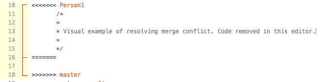
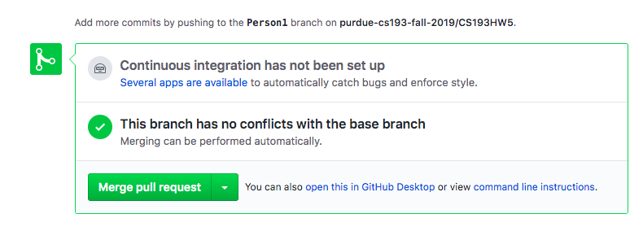

# Steps for Person A:
## Step 1A:Creating your own branch. TODOs exist in this step!
You are tasked to implement a basic calculator function! This function should be able to take in the operator as input and perform the corresponding operation. **The operators are represented by Enum States: ADD, SUBTRACT, MULTIPLY, DIVIDE** Your job is to use **if-elseif-else logic** to implement these calculator functions. If you are unsure how to compare Enums, feel free to look on Google. 
### TODO 2
Create a branch called **PersonA**. To do this, while on the master branch, run `git checkout -b PersonA`. What this does is create a branch called PersonA and switches to that branch. If you run `git status` again, you should see the first line say `On branch PersonA`. 

### TODO 3
Edit the method `basicCalculator` in the file `Implementation.java`. Notice how the method returns a double. `num1` will always be the number that appears first, and `num2` will be the number that appears second. For example if I subtract, the operation should be `num1` - `num2`. If the operation is division and num2 is equal to 0, `return 0.0`. **It is mandatory for you to use if-elseif-else logic here**

### TODO 4
Once you finish making the changes and ensure that your implementation is correct, use the terminal and what you learned in the git lecture to add the file, commit with a meaningful message, and finally push. **The first time you push, Git will tell you to run another command**. For the first push from a branch, you will run `git push --set-upstream origin PersonA`. This command esssentially creates this branch in GitHub, the central repository, for you. 

### TODO 5
Now on if you refresh your GitHub web view again, you should see this dialog pop up. The name of the branch in the picture may be different:

If you don't see this dialog, click on the Pull requests tab near the top of the page -> New pull request -> leave `base` as master but set `compare` to the branch you just pushed.  
Go ahead and create the pull request and merge the pull request into master. There shouldn't be a merge conflict here. 

### TODO 6
Wait until your partner completes step 1B.

## Step 2A: Changing the second method: printValuesandReturnSum. TODOs exist in this step!
Your partner has completed this method using a for loop on their own branch. Surprise! However, management has decided that this needs to be implemented using only while loops. Your job now is to change the method's implementation to use a while loop instead. On branch **PersonA**, the method printValuesandReturnSum should be empty already (remember, your partner's implementation is only on *their branch*)!

### TODO 7
the method `printValuesandReturnSum` iterates through the passed in array, prints out each value of the array, and finally returns the sum at the end. **You must implement this method with a while loop**. 

### TODO 8
Once you finish making the changes and ensure that your implementation is correct, use the terminal to add the file, commit with a meaningful message, and then push. Since you've pushed in a previous step, you would not have to run the `git push --set-upstream...` command. Instead, you can just run `git push`. 

### TODO 9
Now on if you refresh your GitHub web view again, you should see this dialog pop up. The name of the branch in the picture may be different:

Go ahead and create the pull request. There should now be a merge conflict!!

## Step 3A: Resolving the merge conflict. TODOs exist in this step

On the top of the Pull Request page you should see this the message `Cannot automatically merge`.
This image tells you that Git cannot automatically merge. This means that you need to tell Git which lines to keep and which lines to remove. 

### TODO 10
Give your pull request a detailed title, and click the green button `Create pull request`. 

### TODO 11

Now you should see a dialog telling you that `This branch has conflicts that must be resolved`.
Go ahead and click `Resolve Conflicts`

Now you will be brought to a screen that looks like a text editor. In your code you should see lines like `<<<<<PersonA`, `=====`, and `>>>>>>master`. These messages indicate the conflict. The lines of code under `<<<<<<PersonA` and between `=====` indicates the incoming code. The lines after `======` and before `>>>>>master` indicates the lines currently in master

To "choose" your code, remove the code from master, as well as those lines added by Git (like `<<<<<PersonA`). Essentially you want your code to look like what it looked like in IntelliJ. Once the conflicts are resolved, GitHub will tell you by placing a green check mark next to the file name.  
Note: you can also [resolve merge conflicts using git commands and your own text editor](https://help.github.com/en/github/collaborating-with-issues-and-pull-requests/resolving-a-merge-conflict-using-the-command-line)

Now you can click `Mark as Resolved` on the top right and then click `Commit Merge`. 

### TODO 12
Now you will be brought back to the pull request screen and the `Merge pull request` button should now be green.

Now you can click `Confirm merge`. If you go to the commit history on GitHub, you should be able to see your merging commit. 

Congratulations! You have succesfully resolved a merge conflict!!
**Person A is now done with the hw. [Please see final step once Person B is finished](README.md#final-step-once-both-teammates-are-done)**
