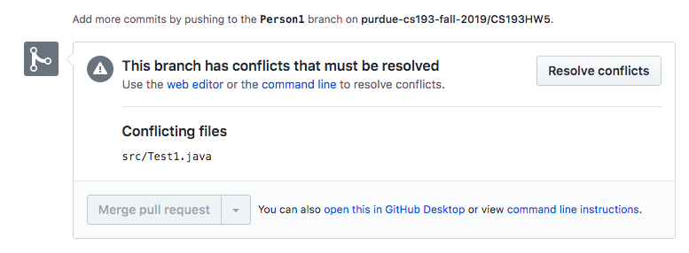
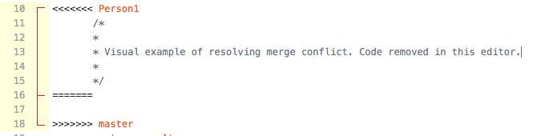
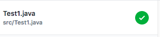
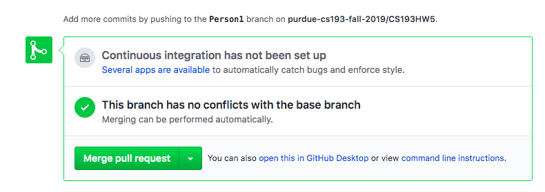
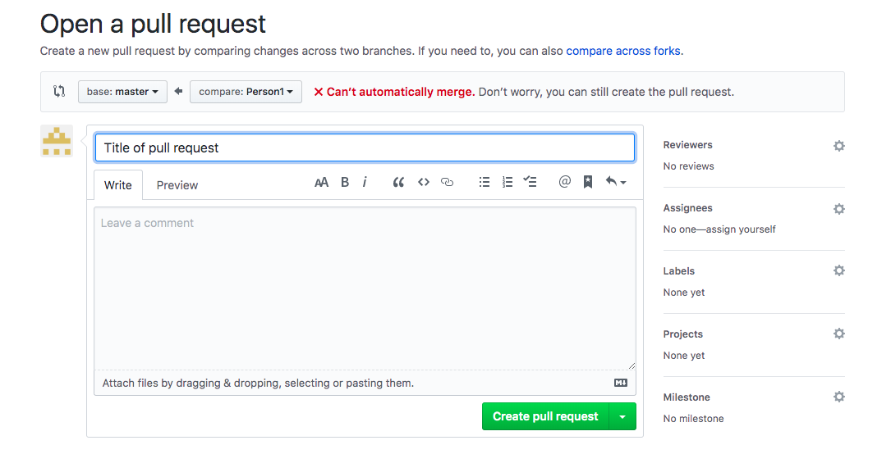

# CS193HW5: Git and Merge Conflicts
 
## What is this assignment
In this assignment, you will be working with a partner to navigate the use of branches and solving merge conflicts. As you learned in lecture, merge conflicts are bound to happen and rather than try to avoid them, we should learn how to manage them. Branching is another key aspect of collaboration. Your teammate and you will work on 2 seperate branches, both different from the master branch, and will implement the same 2 methods in different ways. Merge conflicts will appear, and you and your partner will both have the oppurtunity to fix them. 
 
## When is this due?
This homework will be due on Monday,
 
## When will I know I'm done?
Advice: read the steps!!
 
You are done when you can see 3 different branches (including master), your changes and pull requests are shown in Commit History, and the 2 methods are implemented correctly in all 3 branches. We should be able to see these changes on **GitHub** and not just your terminal.
 
Keep in mind: **For us to see your work it has to be on GitHub, aka the central repository. We can't grade your work if it is just in your local repository.**

**Team Assignments: One teammate will be known as Person A, and the other will be known as Person B throughout this ReadMe. Person A does not have to read PersonB's steps and vice versa**
 
## Step 1 (Both Person A and Person B): Clone the repository. TODOs exist here
### TODO 1 
As you've done before, everything git related usually starts with a clone. Once you have created your copy of the Homework 5 repository (`homework-5-<your GitHub username>`), **run** the command `git clone https://github.com/purdue-cs193-fall-2019/homework-5-<your GitHub username>.git`. As you know, all this command does is to download a copy of the *remote* repository to your *local* machine. 
 
Now if you run `ls`, you should see a directory called `homework-5-<your GitHub username>`. `cd` into this directory and run `ls` again. You should see all the same files that GitHub shows in the browser for this repository. 
 
## Step 2 (Both Person A and Person B): Status
One of the most frequently used git commands is `git status`. Any time you are inside a git repository (i.e. your current directory or one of its parents is an initialized git repository), you can run `git status` to see precisely what state your repository is in. 
 
Make sure you are in the Homework 5 directory and try running `git status`. The output of this command tells you many things. 
 
The first line `On branch master` tells you that you are currently working from the `master` branch of the repository (more on branches later).
 
The second line `Your branch is up to date with 'origin/master'` tells you that your local repository (the files stored on your computer) are in the same state as the files stored remotely on the GitHub repository.
 
The third line `nothing to commit, working tree clean` tells you that you have not made any changes to the files in the repository at this point.
 
## Steps for Person A:
## Step 1A:Creating your own branch. TODOs exist in this step!
You are tasked to implement a basic calculator function! This function should be able to take in the operator as input and perform the corresponding operation. **The operators are represented by Enum States: ADD, SUBTRACT, MULTIPLY, DIVIDE** Your job is to use **if-elseif-else logic** to implement these calculator functions. If you are unsure how to compare Enums, feel free to look on Google. 

### TODO 2
Create a branch called **PersonA**. To do this while on the master branch, run `git checkout -b PersonA`. What this does is create a branch called PersonA and switches to that branch. If you run `git status` again, you should see the first line say `On branch PersonA`. 

### TODO 3
Edit the method `basicCalculator` in the file `Implementation.java`. Notice how the method is returning a double. `num1` will always be the number that appears first, and `num2` will be the number that appears second. For example if I subtract, the operation should be `num1` - `num2`. If the operation is division and num2 is equal to 0, `return 0.0`. **It is mandatory for you to use if-elseif-else logic here**

### TODO 4
Once you finish making the changes and ensure that your implementation is correct, use the terminal to stage the file, commit with a clear message, and finally push. **The first time you push, Git will tell you to run another command**. For the first push from a branch, you will run `git push --set-upstream origin PersonA`. This command esssentially creates this branch in GitHub, the central repository, for you. 

### TODO 5
Now on GitHub, you should see this dialog pop up. The name of the branch on the picture will be different:

Go ahead and create the pull request. There shouldn't be a merge conflict here. 

### TODO 6
Wait until your partner completes step 1B.

## Step 2A: Changing the second method: printValuesandReturnSum. TODOs exist in this step!
Your partner has completed this method using a for loop. Surprise! It has been decided that they want to convert all of their looping mechanisms to while loops. Your job now is to change the method's implementation to use a while loop instead. On branch **PersonA**, the method printValuesandReturnSum should be empty already!

### TODO 7
the method `printValuesandReturnSum` iterates through the passed in array, prints out each value of the array, and finally returns the sum at the end. **You must implement this method with a while loop**. 

### TODO 8
Once you finish making the changes and ensure that your implementation is correct, use the terminal to stage the file, commit with a clear message, and then push. Since you've pushed in a previous step, you would not have to run the git push --set-upstream... command. Therefore, you will just run `git push`. 

### TODO 9
Now on GitHub, you should see this dialog pop up:

Go ahead and create the pull request. There should now be a merge conflict!!

## Step 3A: Resolving the merge conflict. TODOs exist in this step

On the top of the Pull Request page you should see this the message `Cannot automatically merge`.
This image tells you that Git cannot automatically merge. This means that you need to tell Git which lines to keep and which lines to remove. 

### TODO 10
Give your pull request a detailed title, and click the green button `Create pull request`. 

### TODO 11

Now you should see a dialog telling you that `This branch has conflicts that must be resolved`.
Go ahead and click `Resolve Conflicts`

Now you will be brought to a screen that looks like a text editor. In your code you should see lines like `<<<<<PersonA`, `=====`, and `>>>>>>master`. These messages indicate the conflict. The lines of code under `<<<<<<PersonA` and between `=====` indicates the incoming code. The lines after `======` and before `>>>>>master` indicates the lines currently in master

To "choose" your code, remove the code from master, as well as those lines inputted by Git, such as `<<<<<PersonA`. Essentially you want your code to look like what it looked like in IntelliJ. Once the conflicts are resolved, Git will tell you by placing a green check mark next to the file name

Now you can click `Mark as Resolved` on the top right and then click `Commit Merge`. 

### TODO 12
Now you will be brought back to the pull request screen and the `Merge pull request` button should now be green.

Now you can click `Confirm merge`. If you go to the commit history on GitHub, you should be able to see your merging commit. 

Congratulations! You have succesfully resolved a merge conflict!!
**Person A is now done with the hw. Please see Final Step once Person B is finished**

## Steps for Person B:
## Step 1B:Creating your own branch. TODOs exist in this step!
You are tasked to implement function that can print the values of an array and return the sum! This function has the name `printValuesAndReturnSum`. **You must implement this function using a for loop**. 

### TODO 2
Create a branch called **PersonB**. To do this while on the master branch, run `git checkout -b PersonB`. What this does is create a new branch called PersonB and switches to that branch. If you run `git status` again, you should see the first line say `On branch PersonB`. 

### TODO 3
Edit the method `printValuesAndReturnSum` in the file `Implementation.java`. Print out the values of the passed in int array and return the sum of all the values. **It is mandatory for you to use a for loop to iterate through the array**

### TODO 4
Once you finish making the changes and ensure that your implementation is correct, use the terminal to stage the file, commit with a clear message, and finally push. **The first time you push, Git will tell you to run another command**. For the first push from a branch, you will run `git push --set-upstream origin PersonB`. This command esssentially creates this branch in GitHub, the central repository, for you. 

### TODO 5
Now on GitHub, you should see this dialog pop up. The name of the branch in the picture will be different:

Go ahead and create the pull request. There shouldn't be a merge conflict here. 

### TODO 6
Wait until your partner completes step 1A.

## Step 2B: Changing the first method: basicCalculator. TODOs exist in this step!
Your partner has completed this method using if-elseif-else logic. Surprise! It has been decided that you will now implement this function using **switch-cases**. Your job now is to change the method's implementation to use a swithc/case instead. On branch **PersonB**, the method basicCalculator should be empty already!

### TODO 7
The method `basicCalculator` takes in an operator and two numbers and returns a result based on that operator. Keep in mind that the operator is an Enum. The values of the enum are: ADD, SUBTRACT, MULTIPLY, DIVIDE. If you are unsure how to do enum comparisons feel free to look on Google. **You must implement this method with a switch-case**. 

### TODO 8
Once you finish making the changes and ensure that your implementation is correct, use the terminal to stage the file, commit with a clear message, and then push. Since you've pushed in a previous step, you would not have to run the git push --set-upstream... command. Therefore, you will just run `git push`. 

### TODO 9
Now on GitHub, you should see this dialog pop up:

Go ahead and create the pull request. There should now be a merge conflict!!

## Step 3B: Resolving the merge conflict. TODOs exist in this step

On the top of the Pull Request page you should see this the message `Cannot automatically merge`.
This image tells you that Git cannot automatically merge. This means that you need to tell Git which lines to keep and which lines to remove. 

### TODO 10
Give your pull request a detailed title, and click the green button `Create pull request`. 

### TODO 11

Now you should see a dialog telling you that `This branch has conflicts that must be resolved`.
Go ahead and click `Resolve Conflicts`

Now you will be brought to a screen that looks like a text editor. In your code you should see lines like `<<<<<PersonB`, `=====`, and `>>>>>>master`. These messages indicate the conflict. The lines of code under `<<<<<<PersonB` and between `=====` indicates the incoming code. The lines after `======` and before `>>>>>master` indicates the lines currently in master

To "choose" your code, remove the code from master, as well as those lines inputted by Git, such as `<<<<<PersonB`. Essentially you want your code to look like what it looked like in IntelliJ. Once the conflicts are resolved, Git will tell you by placing a green check mark next to the file name

Now you can click `Mark as Resolved` on the top right and then click `Commit Merge`. 

### TODO 12
Now you will be brought back to the pull request screen and the `Merge pull request` button should now be green.

Now you can click `Confirm merge`. If you go to the commit history on GitHub, you should be able to see your merging commit. 

Congratulations! You have succesfully resolved a merge conflict!!
**Person B is now done with the hw. Please see final step once Person A is finished**
 
## Final Step Once Both Teammates Are Done
Make sure that there are 3 branches shown on GitHub, `master`, `PersonA`, and `PersonB`. Make sure that master has the most updated code. This means that the `basicCalculator` should be implemented with switch-cases and `printValuesAndReturnSum` should be implemented with a while loop. Finally, make sure that your commits are shown in the Commit History on GitHub. 
 
## Reminder
Please ask questions if you need them.  Reach out on Piazza, office hours, or PSOs. For grading issues on homeworks, please email one of your PSO TAs. If you email us, we will happily inform you to email your PSO TAs. Good luck :)
